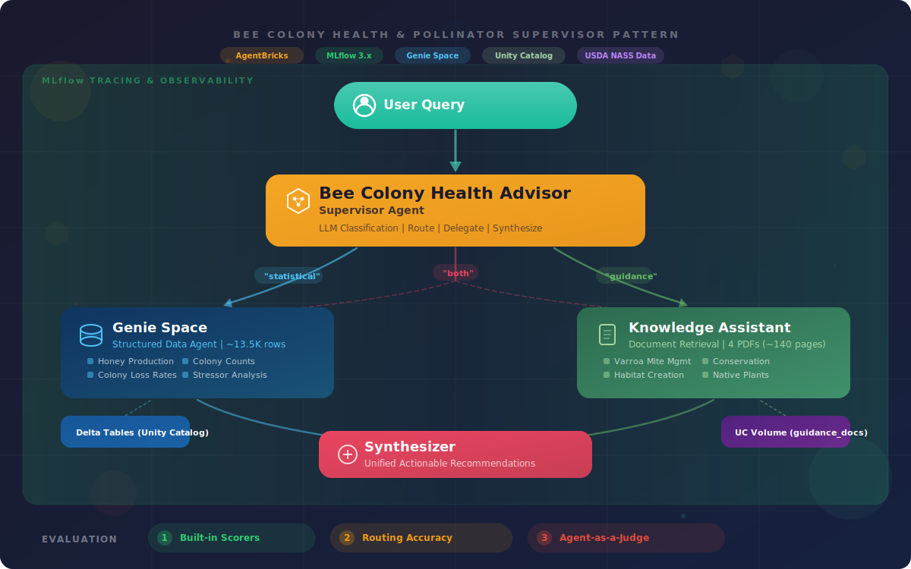

# Bee Colony Health & Pollinator Supervisor Demo

A demonstration of the Databricks [Multi-Agent Supervisor](https://docs.databricks.com/aws/en/generative-ai/agent-bricks/multi-agent-supervisor) pattern using real USDA bee colony health and pollination data. The supervisor routes questions between structured agricultural data (Genie) and beekeeping guidance documents (Knowledge Assistant).

## Architecture



A **Supervisor Agent** intelligently routes user queries to two specialized subagents:

| Subagent | Purpose | Databricks Component |
|----------|---------|---------------------|
| **Genie Agent** | Structured data for bee colonoies queries (SQL, stats, trends) | **Genie Space** → Unity Catalog table |
| **Knowledge Assistant** | Covers varroa mite management, pollinator conservation, agricultural habitat, and native plant guides. | **AgentBricks Knowledge Assistant** → Vector Search index |
| **Synthesizer** | Routes, delegates, synthesizes responses from both subagents | **AgentBricks Supervisor Agent** |

**Structured data (Genie):** ~13,500 rows of real USDA NASS data — honey production, colony loss rates, and colony stressors by state/year (2015-2025).

**Documents (Knowledge Assistant):** 4 public-domain PDFs (~140 pages) covering varroa mite management, pollinator conservation, agricultural habitat, and native plant guides.

See [docs/DATA_SOURCES.md](docs/DATA_SOURCES.md) for full sourcing, licensing, and refresh details.

## Prerequisites

- Databricks workspace with Unity Catalog enabled
- Databricks CLI v0.218+ (`databricks --version`)
- A catalog you can write to and a SQL Warehouse ID
- **No API key needed** — data snapshots and PDFs ship in the repo

## Setup

### Step 1: Deploy and run the bundle (~10 minutes)

```bash
cd demos/bee-pollinator

databricks bundle deploy \
  --var="catalog=your_catalog" \
  --var="warehouse_id=your_warehouse_id"

databricks bundle run setup_demo \
  --var="catalog=your_catalog" \
  --var="warehouse_id=your_warehouse_id"
```

Add `--profile your_profile` if not using the default CLI profile.

This creates 3 Delta tables, uploads 4 PDFs to a UC Volume, and creates a Genie Space and Knowledge Assistant — all automated.

| Variable | Default | Description |
|----------|---------|-------------|
| `catalog` | `main` | Unity Catalog catalog name |
| `schema` | `bee_pollinator` | Schema for demo tables |
| `warehouse_id` | — (required) | SQL Warehouse ID for Genie Space |

### Step 2: Create the Supervisor Agent (~5 minutes)

The Supervisor Agent has no API yet, so this step is done in the UI.

1. Navigate to **Agents** in the left sidebar
2. Click **Create Supervisor Agent** (or **+ New** > **Supervisor Agent**)
3. Fill in the fields:
   - **Name:** `Bee Colony Health Advisor`
   - **Description:** `Routes questions about bee colony health between USDA statistical data and beekeeping guidance documents`
   - **Add Agents:**
     - Click **Add Agent** and select **`USDA Bee Health Data`** (Genie Space)
     - Click **Add Agent** again and select **`Bee Health Documents`** (Knowledge Assistant)
   - **Instructions:**

```
You are a bee colony health and pollinator conservation advisor. You help beekeepers, farmers, and agricultural extension agents by combining USDA data analysis with expert guidance from beekeeping and conservation documents.

Route questions as follows:

1. Data/Statistics → Genie Space (USDA Bee Health Data)
   Questions about honey production, colony counts, loss rates, stressors, trends over time.

2. Guidance/Best Practices → Knowledge Assistant (Bee Health Documents)
   Questions about varroa management, treatment protocols, USDA programs, habitat creation, native plants.

3. Combined → Both Agents
   Questions that need both data context and expert guidance. Use data to establish context, then documents for actionable recommendations.

When synthesizing from both agents, connect the data insight to the document guidance and provide specific, actionable recommendations. Cite data sources and document sections.
```

4. Click **Save** / **Deploy**

### Step 3: Verify

Confirm in the Databricks UI:
- **Data** > your catalog > your schema: 3 tables (`honey_production`, `colony_loss`, `colony_stressors`) and a `guidance_docs` volume with 4 PDFs
- **Agents**: Genie Space, Knowledge Assistant, and Supervisor Agent all present
- Knowledge Assistant indexing may take 1-3 minutes to finish

Test the Supervisor Agent with these queries:

| Type | Query |
|------|-------|
| Data (Genie) | "Which 5 states had the highest colony loss rates in 2023?" |
| Document (KA) | "What does the Varroa Management Guide recommend for monitoring mite levels?" |
| Cross-modal | "California lost 35% of colonies in 2023. What varroa management practices should California beekeepers prioritize?" |

### Alternative: Local CLI setup (no DABs)

```bash
python scripts/setup_data.py --catalog your_catalog --schema bee_health
python scripts/setup_agents.py --catalog your_catalog --schema bee_health --warehouse-id your_warehouse_id
```

Then create the Supervisor Agent manually per Step 2 above.

## Running the Demo

The demo is a ~5 minute walkthrough of the three query types above, showing how the Supervisor routes each one differently:

1. **Data query** — routes to Genie, generates SQL, returns tabular results
2. **Document query** — routes to Knowledge Assistant, retrieves from PDFs, cites sources
3. **Cross-modal query** — uses both agents and synthesizes a combined answer

After running the queries, show **MLflow traces** (Machine Learning > Experiments > find the Supervisor Agent experiment > Traces tab) to demonstrate built-in observability — you can see which sub-agents were called and how long each step took.

### Backup queries

If any of the primary queries don't land well:

- Data: `Show me honey production trends in California over the last 5 years.`
- Document: `Which native plants should I recommend for spring forage in the Northeast?`
- Cross-modal: `North Dakota produces the most honey but has significant colony loss. What management practices should they adopt?`

## Teardown

```bash
# Remove bundle-managed resources (job definition)
databricks bundle destroy

# Tables, schema, volume, and agents must be cleaned up separately:
#   - Drop schema (cascades to tables and volume)
#   - Delete Genie Space and Knowledge Assistant from the UI or via SDK
#   - Delete Supervisor Agent from the UI
```

## Troubleshooting

| Problem | Solution |
|---------|----------|
| `bundle validate` auth error | Run `databricks auth login --profile your_profile` |
| `load_data` task fails reading CSVs | Verify bundle deployed: `databricks workspace ls "/Workspace/Users/<you>/.bundle/bee-pollinator-demo/dev/files/data/snapshots"` |
| `create_agents` fails with missing module | Bump `databricks-sdk` version in `databricks.yml` |
| "Table not found" in Genie | Verify tables exist in Data browser; re-run `bundle run setup_demo` |
| KA returns "No relevant documents" | Check PDFs in the `guidance_docs` volume; wait for indexing to finish |
| Supervisor routes incorrectly | Verify both sub-agents are added; check instructions are pasted correctly; test sub-agents individually first |

## License

Data sources are public domain USDA datasets. PDF documents retain their original licenses (typically public domain or CC-BY for USDA publications).
