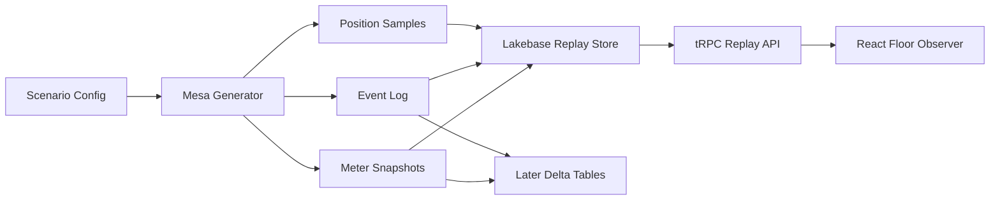

# Agent-Based Simulation Recommendation

This note evaluates how to implement the casino-floor simulation layer before scaffolding the Databricks App. The goal is an observer/operator demo: patrons move through a floor, choose activities, use machines, and emit accounting-shaped telemetry. Users do not play slots.

## Recommendation

Build the first simulator as a **Mesa-first event generator** with a **Databricks AppKit replay UI**.

Use:

- **ABM-style rules** for patrons: arrival, motivation, walking, waiting, machine choice, bar visits, budget depletion, and exit.
- **Discrete events** for accounting-relevant actions: session start/end, bet settled, jackpot, machine fault, meter poll, configuration change, and voucher/cash movement.
- **Mesa as the authoritative generator** for event sequences and sampled patron positions.
- **Lakebase and/or Delta as replay stores** for generated runs, event records, meter snapshots, and sampled positions.
- **React/AppKit as a replay observer UI**, with the client animating between generated samples rather than running the simulation.

This gives the project a real ABM workbench from the start and avoids forcing the AppKit server to own live simulation state before live parameter changes are needed. The tradeoff is that v1 is replay-oriented: scenario parameters are chosen before a run, then the app plays back the generated run.

## Why This Fits

At the target scale, the simulation is small:

- 20 slot machines.
- 50-100 active patrons.
- A grid-like floor with a bar, entrance/exit, and machine banks.
- A few events per patron per simulated second or minute, depending on speed.

CPU is not the likely constraint. The real constraints are:

- Avoiding high-frequency writes of every animation frame to Lakebase.
- Keeping UI state synchronized without making the browser the source of truth.
- Preserving deterministic replay so demo runs can be explained and regenerated.
- Maintaining one clean event contract for later analytics.

The practical architecture is a generated-run replay model:

## Technology Options

### Python Mesa

This is the recommended v1 path.

Pros:

- Strong ABM learning value from the start.
- Mature Python ecosystem and examples.
- Natural fit for grid worlds, agent state, scheduled actions, and data collection.
- Can generate arbitrary simulated duration: minutes, days, years, or many parameterized runs.
- Good fit for deterministic replay when outputs are event logs plus sampled positions.
- Keeps the AppKit UI focused on replay, inspection, and storytelling rather than simulation authority.

Cons:

- Scenario parameters are not changed live during a run in v1.
- Adds a Python generation step alongside the TypeScript app.
- The AppKit UI needs a loader/replay contract rather than direct in-process simulation state.

Use this when:

- The first priority is learning and demonstrating ABM behavior.
- Long generated histories are valuable for analysis.
- Replay is acceptable for the visual experience.

### Server-Side TypeScript, Mostly Custom

This was the original live-simulation recommendation and remains a good later option if live intervention becomes essential.

Pros:

- Same language/runtime as AppKit server and React types.
- Direct access to Lakebase through server-side tRPC procedures.
- Easy to share domain types between server and client.
- Good fit for a small, constrained grid model.
- Determinism is straightforward with seeded RNG and ordered event IDs.

Cons:

- We would need to implement ABM infrastructure ourselves.
- Less direct learning value than starting from Mesa.
- It pushes us toward live simulator lifecycle concerns before we know whether replay is enough.

Use this when:

- We need live parameter changes while a run is active.
- Replay no longer satisfies the demo.
- The Mesa model has stabilized and the core rules are ready to port.

### Python SimPy

SimPy is a discrete-event simulation library. It is excellent for queues, resources, timed processes, and stochastic systems.

Pros:

- Strong mental model for events, queues, resources, and timing.
- Good fit for slot sessions, bar wait times, machine occupancy, faults, and meter polls.
- Deterministic replay is achievable with seeded random streams.

Cons:

- It is not primarily a spatial ABM framework.
- Patron walking and floor visualization would need custom modeling anyway.
- Same Python sidecar issue as Mesa.

Use this when:

- The core problem shifts toward process simulation and queues rather than visual movement.
- We want to prototype telemetry generation without the live floor UI.

### AgentPy

AgentPy is oriented toward scientific experiments and repeated runs.

Pros:

- Nice for parameter sweeps, Monte Carlo runs, and sensitivity analysis.
- Integrates well with Python data science workflows.

Cons:

- Smaller ecosystem than Mesa.
- Less compelling for a production-ish Databricks App surface.
- Still requires a Python bridge.

Use this when:

- We want offline experiments comparing patron behavior parameters.

### Browser-Side Simulation

The browser should not own the business simulation.

Pros:

- Smoothest animation.
- Simple for purely visual prototypes.

Cons:

- Weak source of truth for money, meters, and event ordering.
- Harder deterministic replay across clients.
- Bad fit for accounting-shaped telemetry.
- Browser refreshes or multiple viewers complicate state.

Use this only for:

- Cosmetic interpolation between server updates.
- Prototype-only animation spikes that do not emit authoritative events.

## Proposed V1 Design

### Runtime

Run one authoritative Mesa generation process that produces replay artifacts. The AppKit server reads and serves those artifacts.

Core components:

- `CasinoModel`: Mesa model with run seed, clock, floor, machines, bar, arrivals, and scenario parameters.
- `PatronAgent`: Mesa agent with preferences, state, target, wallet, budget, and next action.
- `MachineAgent` or `MachineResource`: stationary machine with occupancy, configuration, status, meters, and current session.
- `EventEmitter`: writes ordered business events as the model advances.
- `MeterPoller`: emits absolute meter snapshots at configured intervals.
- `PositionSampler`: records patron positions and facing at replay-friendly cadence.
- `ReplayLoader`: loads generated outputs into Lakebase or Delta for the AppKit UI.

### Time Model

Use a Mesa model clock plus scheduled or tick-derived events:

- Model step: a chosen simulated interval, for example 1-5 simulated seconds.
- Movement: updated on model steps.
- Spins, bar service, faults, and meter polls: emitted as timestamped events.
- Replay samples: position snapshots at 5-10 Hz equivalent for short demos, lower for long histories.
- App playback: wall-clock speed is independent from generation speed.

This lets Mesa generate long histories as fast as practical while the UI replays only the sampled visual state it needs.

### Persistence Model

Persist:

- Simulation runs and seeds.
- Scenario configuration.
- Machine configuration.
- Patron definitions and sampled patron state.
- Append-only activity events.
- Meter snapshots.

Do not persist:

- Per-frame sprite animation.
- Pixel interpolation.
- Hover/selection UI state.
- Every intermediate pathfinding step.

The event log should be the business truth. Replay state tables are projections that make the app fast and easy to render.

### Determinism And Replay

Use:

- A seeded pseudo-random generator.
- Monotonic sequence numbers per simulation run.
- Event IDs derived from run ID plus sequence.
- Explicit random streams or tags for arrivals, movement choices, slot outcomes, faults, and jackpot behavior.

Replay means: given the same run config, seed, and model version, the simulator can regenerate the same business event sequence and sampled positions. The UI animation can interpolate between samples and does not need to be pixel-perfect at every intermediate frame.

## First-Slice Implementation Plan

The ABM slice should come before Genie or analytics.

1. Scaffold an AppKit app with Lakebase support.
2. Create a Python Mesa simulation package or lab under the demo.
3. Define the shared event/sample schema for generated runs.
4. Implement deterministic scenario configuration and seeded generation.
5. Implement simple patron rules:
   - Enter.
   - Choose target activity.
   - Walk to target.
   - Use machine or visit bar.
   - Reconsider when budget, patience, or state changes.
   - Exit.
6. Implement slot machine resource rules:
   - One active patron per machine.
   - Bet cadence by patron and machine denomination.
   - Synthetic outcome distribution by volatility class.
   - Meter updates from the same event that settles the bet.
7. Load generated events, meter polls, and sampled positions into Lakebase or local replay files.
8. Render a React observer floor:
   - Grid/floor layout.
   - Moving patron sprites or markers.
   - Machine status.
   - Selected machine/patron inspector.
   - Event feed.
   - Replay controls.
9. Export accounting events and meter polls later to Delta/Genie after the generated schema is stable.

## Libraries To Consider Later

For v1, use Mesa for generation and avoid introducing a browser or TypeScript ABM framework unless live intervention becomes important.

Potential later additions:

- **SimPy** for exploring queue/resource/process behavior.
- **Flocc** if we later want a TypeScript ABM library for live interaction.
- **SimScript** if discrete-event scheduling in TypeScript becomes more important than ABM structure.

The first implementation should keep the event schema explicit so the AppKit replay UI and later Delta tables are not tightly coupled to Mesa internals.

## Research Notes

- Casino-floor simulation research commonly uses Monte Carlo, transition probabilities, and slot/player segmentation to reason about machine mix and movement.
- Mesa is the most mature Python ABM ecosystem and now includes stable event scheduling APIs alongside grid and agent abstractions.
- SimPy is strong for DES but does not remove the need to model spatial patron behavior.
- JavaScript/TypeScript ABM libraries exist, including Flocc and Agentscript, but a custom engine is reasonable at this scale.

## Decision

Use **Mesa-first event generation plus AppKit replay UI** for the first build.

Use a custom TypeScript live simulator later only if the project needs live parameter changes, branching from the current replay point, or in-app simulation controls beyond replay.

