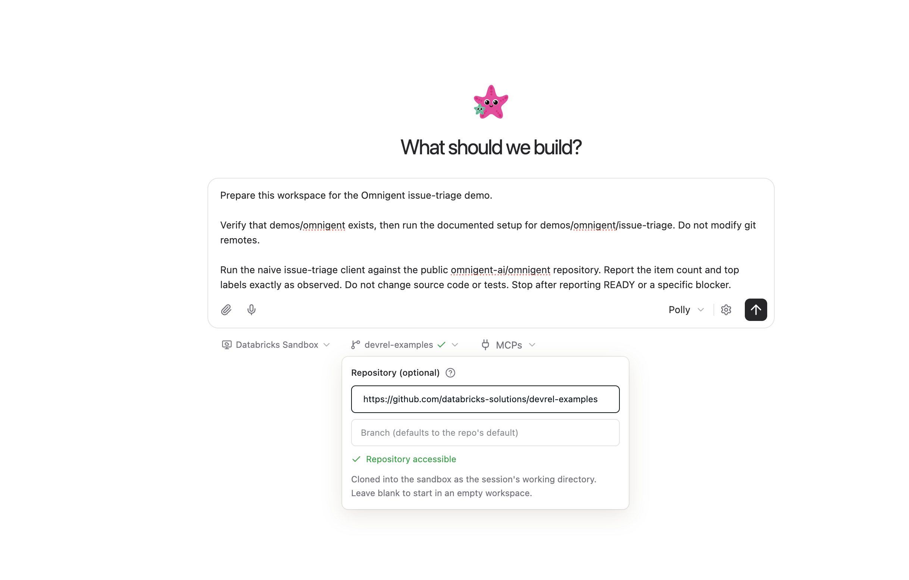
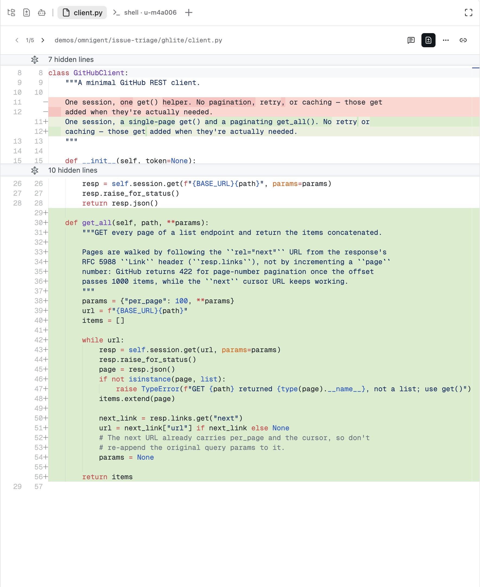
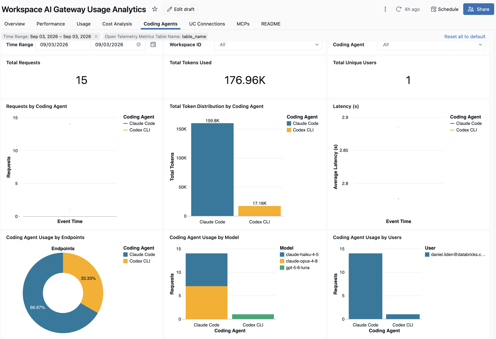

# Omnigent booth demo — presenter guide

> Presenter-led and modular. Adapt the walkthrough to the attendee's interests; they never need an account or keyboard.

## The story

Omnigent is a meta-harness for the coding agents teams already use. It provides one place to coordinate agents across harnesses, inspect and redirect their sessions, manage isolated work, apply policies, and connect model activity to Databricks governance.

The demo uses a deliberately thin Python CLI that calls GitHub's public Issues API, counts open issues, and groups them by label. It worked against a small repository. Against the active `omnigent-ai/omnigent` repository, it stops after GitHub's first 30 results instead of fetching every page—and it mistakenly counts pull requests as issues, producing the wrong total and misleading label rankings. Polly investigates the discrepancy, coordinates the fixes, and leaves reviewed local branches for the human.

Read [Meta-Harness: the Missing Layer Above Claude Code, Codex, and Pi](https://omnigent.ai/blog/meta-harness-missing-layer) for the full narrative behind this scenario.

The most useful surfaces to show are the agent graph, a child session, the combined code diff, a policy approval, and AI Gateway usage. Choose among them based on the conversation.

## Before the event

The presenter's Databricks workspace needs the Omnigent and Sandbox previews in a supported region, serverless egress control must be off for this Sandbox path, and **Polly** must appear in the agent picker. With partial support, feel free to adapt the available Omnigent features into your own demo; use the OSS fallback when the managed path is unavailable.

### Keep one completed session

Run the full demo once before booth duty and keep that completed session intact. Because implementation and review can be slow, it is normally the best artifact to talk through: the full agent graph, findings, branches, tests, review, and combined diff are already available.

If you want to run the demo live from start to finish, start a separate new session in a new Sandbox and follow the prompts below. Keep the completed session untouched.

Immediately before booth duty:

1. Open the completed session and confirm its child sessions load.
2. Confirm the top-level **Changes → Show diff** view contains the combined result.
3. If you plan to show AI Gateway or the phone view, open and verify those surfaces now.

## Start a fresh session

In workspace/omnigent:



1. Select **New session**.
2. Select **Polly**.
3. Select **Databricks Sandbox**.
4. Set repository to `https://github.com/databricks-solutions/devrel-examples`.
5. Leave the branch blank to use `main`.
6. Paste Prompt 0.

No GitHub credentials are required. The demo reads public data and keeps all code changes local.

## Prompt 0 — prepare and show the problem

```text
Prepare this workspace for the Omnigent issue-triage demo.

Verify that demos/omnigent exists, then run the documented setup for demos/omnigent/issue-triage. Do not modify git remotes.

Run the naive issue-triage client against the public omnigent-ai/omnigent repository. Report the item count and top labels exactly as observed. Do not change source code or tests. Stop after reporting READY or a specific blocker.
```

The CLI normally reports exactly **30** items because it reads one default API page. Pull-request labels can appear in what it calls an issue summary. Exact labels and repository totals drift; the stable signal is one page containing mixed object types.

## Prompt 1 — investigate

```text
/investigate This GitHub issue-triage client worked on a small repository, but its output for omnigent-ai/omnigent looks wrong. Use multiple read-only agents to find the problems, report evidence from the code and live GitHub API, and recommend the order in which they should be fixed. Do not edit code or tests yet.
```

Show the task graph and open one investigation child. The important findings are:

- the client ignores GitHub's `Link: rel="next"` pagination;
- the Issues endpoint also returns pull-request objects;
- pagination must land before filtering because both affect issue listing.

The point is dependency-aware coordination across visible agent sessions, not simply running more agents.

## Prompt 2 — implement

```text
Implement the issues from your investigation, working only under demos/omnigent/issue-triage. At minimum, add Link-header pagination first on branch feat/ghlite-pagination, with focused regression tests; then base branch feat/ghlite-filter-prs on that completed result and filter objects containing the pull_request key from the issue list, again with focused regression tests. Report any other findings as follow-up work rather than expanding this demo. Use separate local worktrees where appropriate. Keep all work local: do not push, open a pull request, or merge into the starting branch.

If your standard review flow requires a pull request, stop after producing the local worktree changes and passing tests. Report that limitation clearly; do not try to configure GitHub credentials. Finish by reporting the final stacked branch and the exact fast-forward merge command for the presenter.
```

This may take longer than a booth conversation. Let it run while discussing the graph, or return to the completed session.

To show the work:

1. Open an implementation child to show its activity and result.
2. Open a review child if Polly created one.
3. Run `git worktree list` in the top-level terminal to show the isolated branches.

Child sessions inherit the parent workspace, so their file browsers cannot be rebound to the worktrees. The combined visual diff appears in the top-level session after Prompt 3.

## Prompt 3 — expose the combined diff

Once Polly reports that `feat/ghlite-filter-prs` is ready, open a terminal in the top-level Omnigent session and run:

```bash
git merge --ff-only feat/ghlite-filter-prs
```

Do this quietly. It is a short workaround for Polly's no-merge boundary and the Changes panel's working-tree behavior, not a demo beat.

Then send Polly:

```text
I have fast-forwarded the reviewed branch into the starting branch. Run the full test suite under demos/omnigent/issue-triage. Then read the original starting commit from demos/omnigent/.demo-base and run git reset --mixed to that commit so the combined result remains as working-tree changes for the Omnigent Changes panel. Whether the tests pass or fail, perform the mixed reset and report git status --short. Do not push or modify origin.
```



Open top-level **Changes** and select **Show diff** on `ghlite/client.py`, `ghlite/issues.py`, or either new test file. Reload the session once if the panel has not refreshed.

The reviewed commits remain on `feat/ghlite-filter-prs`; the mixed reset exposes their combined content without losing them. Keep the completed session intact. For another live run, start a new session in a new Sandbox.

## Show a policy approval

1. Open the top-level session's information panel.
2. Under **Policies**, select **Add**.
3. Add **Require Approval for File & Shell Operations** (`ask_on_os_tools`).
4. Send:

   ```text
   Read demos/omnigent/README.md and summarize its first paragraph.
   ```

5. Show the approval card and approve the read.

Use this to discuss governance at the Omnigent layer. Do not claim that a policy attached to the top-level session automatically governed every child session.

## Optional: show AI Gateway usage

Sandbox model calls route through the workspace's Foundation Model APIs over Unity AI Gateway automatically.



Open **AI Gateway**, use the dropdown in the top-right corner to select **Usage dashboard**, set the time-range filter to the current date, and open the **Coding Agents** tab. It can show requests, total tokens, latency, endpoints, destination models, and users across Claude Code and Codex activity.

If today's activity has not appeared yet, broaden the date range rather than waiting. Treat cost analysis, inference tables, and unified traces as optional only when they are already configured and populated.

## Optional: phone view

Show this only if it passed preflight on the exact device and network. Open the same managed session from the Omnigent mobile app using your workspace identity. Never improvise a public tunnel.

## OSS fallback

Use this when the presenter's workspace lacks Omnigent or Sandbox access.

Requirements: local Omnigent, Python 3.12+, Node.js 22 LTS, npm, tmux, and at least two authenticated worker vendors for cross-vendor review.

```bash
git clone --depth 1 --filter=blob:none --sparse \
  https://github.com/databricks-solutions/devrel-examples.git omnigent-demo
cd omnigent-demo
git sparse-checkout set demos/omnigent
cd demos/omnigent/issue-triage
./scripts/setup.sh
cd ../../..
omni polly
```

Use Prompts 0–3. The OSS path does not include Databricks Sandbox or AI Gateway observability.

## Quick recovery

| Problem | Response |
|---|---|
| Polly or Sandbox unavailable | Use the completed session or OSS fallback. |
| Live work is slow | Continue with the completed session. |
| Fewer than two worker vendors available | Explain that Polly supports cross-vendor review, and note that this workspace did not have enough agent vendors available to demonstrate it live. |
| Changes is empty after Prompt 3 | Confirm `git status --short` lists the demo files, then reload once. |
| Policy does not trigger | Use a fresh ordinary session for the policy module. |
| AI Gateway Usage dashboard is empty | Confirm the time-range filter is set to today, then broaden it to a prior date if needed. |

## Features this project lets you discuss

- coordination across Claude Code, Codex, Pi, and other agent harnesses;
- task decomposition, dependency ordering, and isolated worktrees;
- entering and redirecting child sessions;
- independent review and normal engineering artifacts;
- contextual policies and human approval;
- Databricks-managed models, AI Gateway governance, and usage analytics;
- session sharing and optional mobile access.
