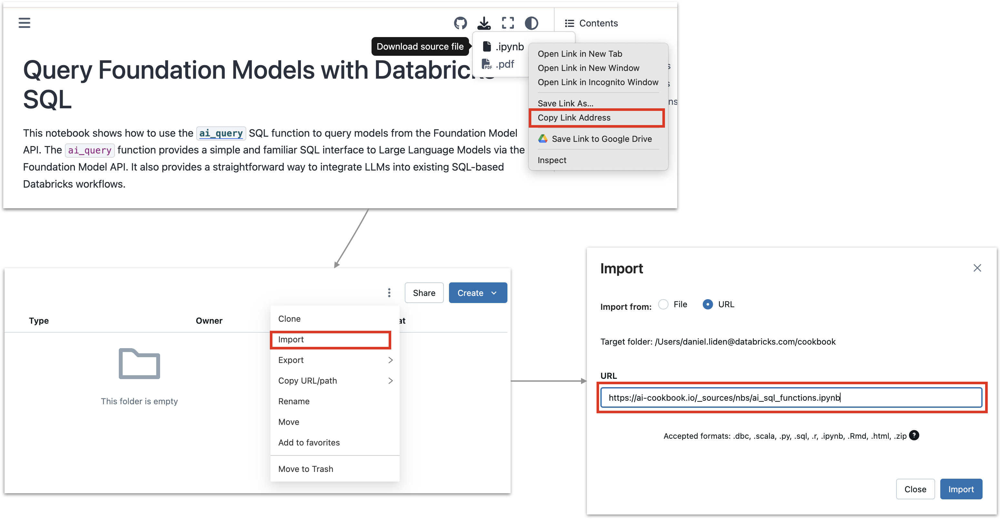

# Databricks DevRel Example Notebooks

This is a collection of notebooks demonstrating a variety of use cases leveraging Databricks functionality. 

## Featured Notebooks

::::{grid} 3
:class-container: text-center

:::{grid-item-card}
:link: nbs/vector_search_fm_api
:link-type: doc
:class-header: bg-light

Embeddings for Vector Search
^^^
Use the Foundation Model API to generate embeddings for Databricks Vector Search.
:::

:::{grid-item-card}
:link: nbs/fm_api_openai_sdk
:link-type: doc
:class-header: bg-light

Use the Foundation Model API with the OpenAI Python SDK
^^^
Convert your OpenAI Python code to use the Foundation Model API with minimal code changes.
:::

:::{grid-item-card}
:link: nbs/streaming_outputs
:link-type: doc
:class-header: bg-light

Generate Streaming Outputs
^^^
Generate streaming outputs with the Python SDK and the REST API.
:::
::::

## How to Run These Notebooks in your Databricks Workspace

### Import individual notebooks

If you want to run one of these notebooks in your Databricks workspace, click the download icon in the upper right corner of the page you would like to run. Then right-click on `.ipynb` and select "Copy link address." In your Databricks workspace, in the workspace view, select "import" (from the three-dots menu or from the right-click menu) and paste in the url you copied. This will import the notebook to your Databricks workspace.



### Clone the repository

You can also clone the whole repository into your workspace. Simply navigate to "Repos" in your Databricks workspace, click "Add Repo", and copy in the URL: [https://github.com/databricks-solutions/devrel-examples](https://github.com/databricks-solutions/devrel-examples). Then click Create Repo. This will clone the repository to your workspace, giving you access to all of the notebooks right in your Databricks workspace. All the notebooks will be found in the `/notebooks/nbs` directory.

## Official Documentation
- [Foundation Model APIs](https://docs.databricks.com/en/machine-learning/foundation-models/index.html)
- [AI Playground](https://docs.databricks.com/en/large-language-models/ai-playground.html)
- [Vector Search](https://docs.databricks.com/en/generative-ai/vector-search.html)
- [AI Functions](https://docs.databricks.com/en/large-language-models/ai-functions.html)


```{tableofcontents}
```


